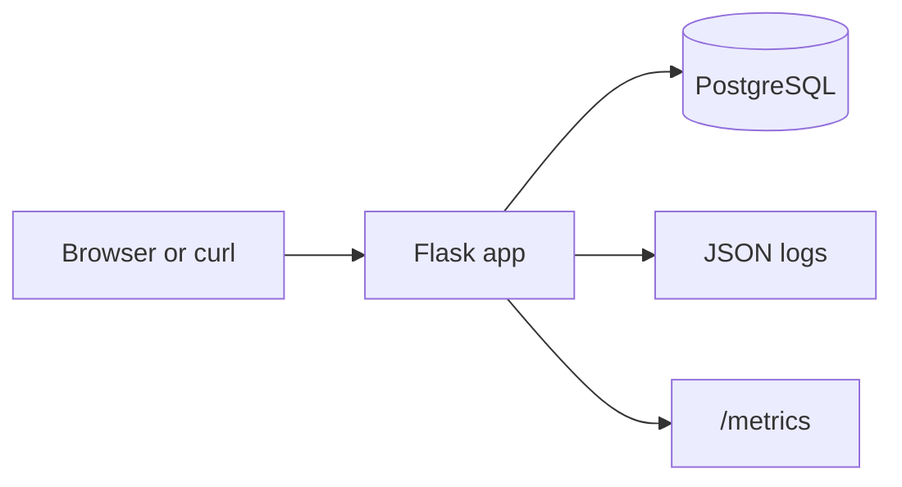

# PE Hackathon Template

Starter app for the MLH PE Hackathon.
Includes Flask, PostgreSQL, Peewee models, JSON logging, metrics, and seed loading.

## Getting Started

Two setup options are available:
- [Docker Compose - easiest option and fastest path](#docker-compose-recommended)
- [Local setup - uv + PostgreSQL](#local-setup-uv--postgresql)

## Documentation

- [API.md](API.md)
- [RELIABILITY.md](RELIABILITY.md)
- [INCIDENT_RESPONSE.md](INCIDENT_RESPONSE.md)
- [SCALABILITY.md](SCALABILITY.md)

## Architecture



## Project Structure

```text
app/
  models/
  routes/
  data/
API.md
README.md
RELIABILITY.md
INCIDENT_RESPONSE.md
SCALABILITY.md
run.py
load_seed.py
```

## Docker Compose (recommended)

### What you need

- Docker Desktop for Windows/macOS
- Docker Engine + Docker Compose plugin for Linux

Docker download/install reference:
https://www.docker.com/products/docker-desktop/

Verify:

```bash
docker --version
docker compose version
```

Clone the repo:

```bash
git clone https://github.com/ndhaliwal59/PE-Hackathon-Template-2026/
cd PE-Hackathon-Template-2026
```

Run:

```bash
docker compose up -d --build
```

Check:

```bash
curl http://localhost:5000/health
```

---

## Local Setup (uv + PostgreSQL)

### What you need

- uv
- PostgreSQL running on `localhost:5432`

Install uv:

Windows PowerShell:

```powershell
powershell -ExecutionPolicy ByPass -c "irm https://astral.sh/uv/install.ps1 | iex"
```

macOS / Linux:

```bash
curl -LsSf https://astral.sh/uv/install.sh | sh
```

Official uv installation docs:
https://docs.astral.sh/uv/getting-started/installation/

Clone the repo:

```bash
git clone https://github.com/ndhaliwal59/PE-Hackathon-Template-2026/
cd PE-Hackathon-Template-2026
```

Install dependencies:

```bash
uv sync
```

Create local `.env` file:

Windows PowerShell:

```powershell
Copy-Item .env.example .env
```

macOS / Linux:

```bash
cp .env.example .env
```

Create database:

```bash
createdb hackathon_db
```

Run app:

```bash
uv run run.py
```

Check:

```bash
curl http://localhost:5000/health
```

## Seed Data

After app and database are ready:

```bash
uv run load_seed.py
```
