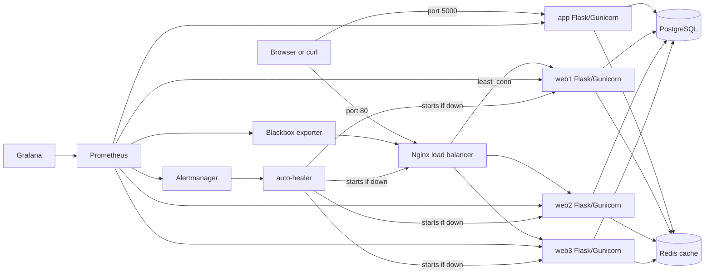

# PE Hackathon Template

Starter app for the MLH PE Hackathon.
Includes Flask, PostgreSQL, Redis-backed caching, Nginx load balancing, Prometheus/Grafana observability, JSON logging, metrics, and seed loading.

## Hackathon Context

This repository was built for the MLH PE Hackathon and is organized to make the project easy to run, use, and review. In addition to the application itself, it includes supporting documentation for areas such as reliability, scalability, incident response, and troubleshooting so reviewers can quickly understand the work across multiple parts of the project.

## Getting Started

Two setup options are available:

- [Docker Compose - easiest option and fastest path](#docker-compose-recommended)
- [Local setup - uv + PostgreSQL](#local-setup-uv--postgresql)

## Documentation

- [API.md](docs/API.md)
- [DEPLOY.md](docs/DEPLOY.md)
- [CONFIG.md](docs/CONFIG.md)
- [RELIABILITY.md](docs/RELIABILITY.md)
- [INCIDENT_RESPONSE.md](docs/INCIDENT_RESPONSE.md)
- [RUNBOOK.md](docs/RUNBOOK.md)
- [SCALABILITY.md](docs/SCALABILITY.md)
- [DECISION_LOG.md](docs/DECISION_LOG.md)
- [CAPACITY_PLAN.md](docs/CAPACITY_PLAN.md)
- [TROUBLESHOOTING.md](docs/TROUBLESHOOTING.md)

## Architecture

The Docker Compose stack provides two request paths:
- **Direct (single instance):** Client → `app` service on port 5000 (for quick testing)
- **Load-balanced (HA):** Client → Nginx on port 80 → web1/web2/web3 (for scalability testing)



If the diagram does not render on your device, you can view it here: [Architecture diagram](docs/assets/architecture-diagram.svg)

## Project Structure

```text
app/
  models/
  routes/
  data/
auto-healer/
frontend/
monitoring/
nginx/
scripts/
  incident/
  k6/
README.md
docs/
  API.md
  DEPLOY.md
  CONFIG.md
  RELIABILITY.md
  INCIDENT_RESPONSE.md
  RUNBOOK.md
  SCALABILITY.md
  DECISION_LOG.md
  CAPACITY_PLAN.md
  TROUBLESHOOTING.md
Dockerfile
docker-compose.yml
run.py
load_seed.py
```

## Docker Compose (recommended)

This option starts the full stack: a single `app` service + three `web` instances behind Nginx load balancer, plus PostgreSQL, Redis, Prometheus, Alertmanager, and Grafana.

### What you need

- Docker Desktop for Windows/macOS
- Docker Engine + Docker Compose plugin for Linux

Docker download/install reference:
https://www.docker.com/products/docker-desktop/

Verify:

```bash
docker --version
docker compose version
```

Clone the repo:

```bash
git clone https://github.com/ndhaliwal59/PE-Hackathon-Template-2026/
cd PE-Hackathon-Template-2026
```

Run:

```bash
docker compose up -d --build
```

If this fails because Docker is not running, see [TROUBLESHOOTING.md](docs/TROUBLESHOOTING.md#docker-compose-fails-because-docker-is-not-running).

Check running services:

```bash
docker compose ps
```

Check app health (direct path):

```bash
curl http://localhost:5000/health
# expected output:
# {"status":"ok"}
```

Check app health through load balancer (Nginx):

```bash
curl http://localhost/health
# expected output:
# {"status":"ok"}
```

Open the URL Shortener web UI (no extra install required — served by Flask):

- Direct: [http://localhost:5000/ui](http://localhost:5000/ui)
- Through Nginx: [http://localhost/ui](http://localhost/ui)

Access observability tools:

- Prometheus: [http://localhost:9090](http://localhost:9090)
- Grafana: [http://localhost:3000](http://localhost:3000) (admin/admin)
- Alertmanager: [http://localhost:9093](http://localhost:9093)

---

## Local Setup (uv + PostgreSQL)

### What you need

- uv
- PostgreSQL server running on `localhost:5432`
- PostgreSQL CLI tools available in your shell (`psql`; `createdb` is preferred but optional)

1. Install uv

   Choose the command for your platform:

   - Windows PowerShell

     ```powershell
     powershell -ExecutionPolicy ByPass -c "irm https://astral.sh/uv/install.ps1 | iex"
     ```

   - macOS / Linux

     ```bash
     curl -LsSf https://astral.sh/uv/install.sh | sh
     ```

   Official uv installation docs: https://docs.astral.sh/uv/getting-started/installation/

2. Install PostgreSQL (server + CLI tools)

  Use the official PostgreSQL installer for your platform, then make sure `psql` and `pg_isready` are available in your terminal. `createdb` is optional convenience; if it is installed, you can use it for a shorter database creation command.

   Download/install references:

   - Windows: https://www.postgresql.org/download/windows/
   - macOS: https://www.postgresql.org/download/macosx/
   - Linux: https://www.postgresql.org/download/linux/

   Optional package-manager commands if you already use them:

   - macOS (Homebrew)

     ```bash
     brew install postgresql@16
     ```

   - Ubuntu/Debian

     ```bash
     sudo apt update
     sudo apt install -y postgresql postgresql-client
     ```

   Official PostgreSQL download/install docs: https://www.postgresql.org/download/

   If the commands above are not recognized after installation, add PostgreSQL's `bin` folder to your PATH, then restart the terminal.

   Verify your CLI tools are available:

   ```bash
   psql --version
   pg_isready --version
   ```

    If `createdb` is installed, you can also verify it with:

    ```bash
    createdb --version
    ```

   Verify PostgreSQL is reachable on localhost:

   ```bash
   pg_isready -h localhost -p 5432
   ```

3. Clone the repo

  ```bash
  git clone https://github.com/ndhaliwal59/PE-Hackathon-Template-2026/
  cd PE-Hackathon-Template-2026
  ```

4. Install dependencies

  ```bash
  uv sync
  ```

5. Create the local `.env` file

   Choose the command for your platform:

   - Windows PowerShell

     ```powershell
     Copy-Item .env.example .env
     ```

   - macOS / Linux

     ```bash
     cp .env.example .env
     ```

6. Create the database

  ```bash
  createdb hackathon_db
  ```

    If `createdb` is not available, use:

    ```bash
    psql -U postgres -c "CREATE DATABASE hackathon_db;"
    ```

    Use whichever command fits your installation. `createdb` is the simpler option when it is available; `psql` is the fallback.

7. Run the app

  ```bash
  uv run run.py
  ```

8. Check the app

  ```bash
  curl http://localhost:5000/health
  # expected output:
  # {"status":"ok"}
  ```

Open the URL Shortener web UI: [http://localhost:5000/ui](http://localhost:5000/ui)

## Seed Data

After the app and database are ready, load sample data so you can test the app immediately:

```bash
uv run load_seed.py
```

## Quick Usage

This section shows a minimal terminal workflow for using the app after setup is complete and the app is already running.

### Windows PowerShell

```powershell
# Use the direct app path:
$BASE_URL = "http://localhost:5000"

# Or use the Nginx load-balanced path:
# $BASE_URL = "http://localhost"
```

1. Health check

```powershell
curl.exe "$BASE_URL/health"
```

2. Create a user

```powershell
@'
{"username":"user","email":"user@example.com"}
'@ | curl.exe -X POST "$BASE_URL/users" -H "Content-Type: application/json" --data-binary "@-"
```

3. Create a short URL
   Replace `1` with the `id` returned from step 2.

```powershell
@'
{"user_id":1,"original_url":"https://example.com","title":"Example"}
'@ | curl.exe -X POST "$BASE_URL/urls" -H "Content-Type: application/json" --data-binary "@-"
```

4. List URLs

```powershell
curl.exe "$BASE_URL/urls"
```

5. Test the short link
   Replace `REPLACE_SHORT_CODE` with the `short_code` returned in step 3.

```powershell
curl.exe -i "$BASE_URL/s/REPLACE_SHORT_CODE"
```

### macOS / Linux

```bash
# Use the direct app path:
BASE_URL=http://localhost:5000

# Or use the Nginx load-balanced path:
# BASE_URL=http://localhost
```

1. Health check

```bash
curl "$BASE_URL/health"
```

2. Create a user

```bash
curl -X POST "$BASE_URL/users" \
  -H "Content-Type: application/json" \
  -d '{"username":"user","email":"user@example.com"}'
```

3. Create a short URL
   Replace `1` with the `id` returned from step 2.

```bash
curl -X POST "$BASE_URL/urls" \
  -H "Content-Type: application/json" \
  -d '{"user_id":1,"original_url":"https://example.com","title":"Example"}'
```

4. List URLs

```bash
curl "$BASE_URL/urls"
```

5. Test the short link
   Replace `REPLACE_SHORT_CODE` with the `short_code` returned in step 3.

```bash
curl -i "$BASE_URL/s/REPLACE_SHORT_CODE"
```

For the full endpoint reference, see [API.md](docs/API.md).
