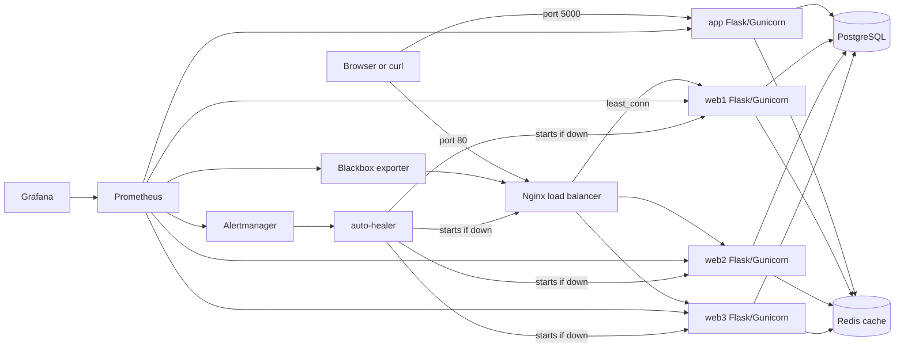

# PE Hackathon Template

Starter app for the MLH PE Hackathon.
Includes Flask, PostgreSQL, Redis-backed caching, Nginx load balancing, Prometheus/Grafana observability, JSON logging, metrics, and seed loading.

## Getting Started

Two setup options are available:

- [Docker Compose - easiest option and fastest path](#docker-compose-recommended)
- [Local setup - uv + PostgreSQL](#local-setup-uv--postgresql)

## Documentation

- [API.md](docs/API.md)
- [DEPLOY.md](docs/DEPLOY.md)
- [CONFIG.md](docs/CONFIG.md)
- [RELIABILITY.md](docs/RELIABILITY.md)
- [INCIDENT_RESPONSE.md](docs/INCIDENT_RESPONSE.md)
- [RUNBOOK.md](docs/RUNBOOK.md)
- [SCALABILITY.md](docs/SCALABILITY.md)
- [DECISION_LOG.md](docs/DECISION_LOG.md)
- [CAPACITY_PLAN.md](docs/CAPACITY_PLAN.md)
- [TROUBLESHOOTING.md](docs/TROUBLESHOOTING.md)

## Architecture

The Docker Compose stack provides two request paths:
- **Direct (single instance):** Client → `app` service on port 5000 (for quick testing)
- **Load-balanced (HA):** Client → Nginx on port 80 → web1/web2/web3 (for scalability testing)



If the diagram does not render on your device, you can view it here: [Architecture diagram](docs/assets/architecture-diagram.svg)

## Project Structure

```text
app/
  models/
  routes/
  data/
auto-healer/
frontend/
monitoring/
nginx/
scripts/
  incident/
  k6/
README.md
docs/
  API.md
  DEPLOY.md
  CONFIG.md
  RELIABILITY.md
  INCIDENT_RESPONSE.md
  RUNBOOK.md
  SCALABILITY.md
  DECISION_LOG.md
  CAPACITY_PLAN.md
  TROUBLESHOOTING.md
Dockerfile
docker-compose.yml
run.py
load_seed.py
```

## Docker Compose (recommended)

This option starts the full stack: a single `app` service + three `web` instances behind Nginx load balancer, plus PostgreSQL, Redis, Prometheus, Alertmanager, and Grafana.

### What you need

- Docker Desktop for Windows/macOS
- Docker Engine + Docker Compose plugin for Linux

Docker download/install reference:
https://www.docker.com/products/docker-desktop/

Verify:

```bash
docker --version
docker compose version
```

Clone the repo:

```bash
git clone https://github.com/ndhaliwal59/PE-Hackathon-Template-2026/
cd PE-Hackathon-Template-2026
```

Run:

```bash
docker compose up -d --build
```

Check running services:

```bash
docker compose ps
```

Check app health (direct path):

```bash
curl http://localhost:5000/health
# expected output:
# {"status":"ok"}
```

Check app health through load balancer (Nginx):

```bash
curl http://localhost/health
# expected output:
# {"status":"ok"}
```

Open the URL Shortener web UI (no extra install required — served by Flask):

- Direct: [http://localhost:5000/ui](http://localhost:5000/ui)
- Through Nginx: [http://localhost/ui](http://localhost/ui)

Access observability tools:

- Prometheus: [http://localhost:9090](http://localhost:9090)
- Grafana: [http://localhost:3000](http://localhost:3000) (admin/admin)
- Alertmanager: [http://localhost:9093](http://localhost:9093)

---

## Local Setup (uv + PostgreSQL)

### What you need

- uv
- PostgreSQL running on `localhost:5432`

1. Install uv

   Choose the command for your platform:

   - Windows PowerShell

     ```powershell
     powershell -ExecutionPolicy ByPass -c "irm https://astral.sh/uv/install.ps1 | iex"
     ```

   - macOS / Linux

     ```bash
     curl -LsSf https://astral.sh/uv/install.sh | sh
     ```

   Official uv installation docs: https://docs.astral.sh/uv/getting-started/installation/

2. Clone the repo

  ```bash
  git clone https://github.com/ndhaliwal59/PE-Hackathon-Template-2026/
  cd PE-Hackathon-Template-2026
  ```

3. Install dependencies

  ```bash
  uv sync
  ```

4. Create the local `.env` file

   Choose the command for your platform:

   - Windows PowerShell

     ```powershell
     Copy-Item .env.example .env
     ```

   - macOS / Linux

     ```bash
     cp .env.example .env
     ```

5. Create the database

  ```bash
  createdb hackathon_db
  ```

6. Run the app

  ```bash
  uv run run.py
  ```

7. Check the app

  ```bash
  curl http://localhost:5000/health
  # expected output:
  # {"status":"ok"}
  ```

Open the URL Shortener web UI: [http://localhost:5000/ui](http://localhost:5000/ui)

## Seed Data

After app and database are ready:

```bash
uv run load_seed.py
```
