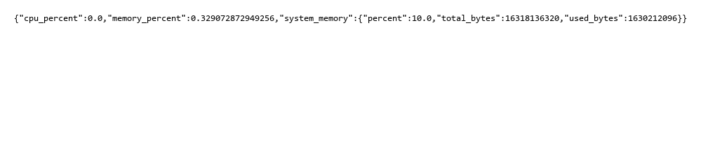
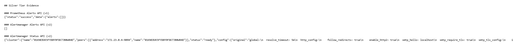
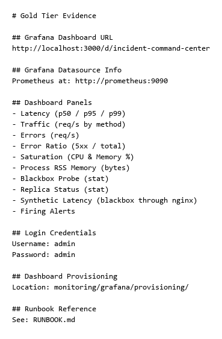

# Incident Response (Bronze + Silver + Gold)

This document covers the Bronze, Silver, and Gold incident response quests for this repo.

**Troubleshooting:** If you encounter startup or runtime issues, see [TROUBLESHOOTING.md](TROUBLESHOOTING.md) for common problems and solutions.

If you want the replicated-service crash recovery demo, see [RELIABILITY.md](RELIABILITY.md#ha-recovery-demo).

## Run the app

Start the app the same way as the rest of the project:

```bash
uv run run.py
```

If you are using Docker Compose, you can also start the full stack with:

```bash
docker compose up -d --build
```

If this fails because Docker is not running, see [TROUBLESHOOTING.md](TROUBLESHOOTING.md#docker-compose-fails-because-docker-is-not-running).


## Check metrics

The app exposes a JSON metrics endpoint at `/metrics`:

```bash
curl http://localhost:5000/metrics
```

Example response shape:

```json
{
  "cpu_percent": 0.0,
  "memory_percent": 0.0,
  "system_memory": {
    "total_bytes": 0,
    "used_bytes": 0,
    "percent": 0.0
  }
}
```

## View logs without SSH

Use Docker Compose to follow the app logs:

```bash
docker compose logs -f --tail 20 app
```

This shows the last 20 log lines from the app container and keeps following new lines.

## Quick checks

```bash
curl http://localhost:5000/health
curl http://localhost:5000/metrics
```

If both commands return JSON successfully, the app is running and the incident response Bronze checks are in place.

**Health check response**
[Bronze health output](assets/evidence/incident-response/bronze-health.txt)

**Metrics endpoint response**


**Docker services status**
[Bronze services list](assets/evidence/incident-response/bronze-services.txt)

## Silver (Prometheus, Alertmanager, Discord)

Silver adds **Prometheus** (rules + scraping), **Blackbox** (synthetic health through nginx), and **Alertmanager** (notifications to **Discord** via webhook). Alert rule definitions live in [`monitoring/rules/incident.yml`](../monitoring/rules/incident.yml). [`monitoring/alertmanager-entrypoint.sh`](../monitoring/alertmanager-entrypoint.sh) merges [`monitoring/alertmanager.yml.tpl`](../monitoring/alertmanager.yml.tpl) with `DISCORD_WEBHOOK_URL` at container start.

### Configure Discord

1. Create a Discord incoming webhook for your channel.
2. Set `DISCORD_WEBHOOK_URL` in `.env` (see [`.env.example`](../.env.example)). If unset, Compose uses a placeholder URL so stacks still start; Discord will reject notifications until you set a real webhook.

For full environment variable details, see [CONFIG.md](CONFIG.md).

### Start the stack

```bash
docker compose up -d --build
```

For deployment and rollback steps, see [DEPLOY.md](DEPLOY.md).

- Prometheus UI: [http://localhost:9090](http://localhost:9090)
- Alertmanager UI: [http://localhost:9093](http://localhost:9093)

### Prometheus scrape endpoint (text)

The app still serves Bronze JSON at `/metrics`. Prometheus scrapes **text** exposition at `/prometheus/metrics` on each `web*` replica (not exposed on the host by default; use Docker networking or `docker compose exec`).

```bash
docker compose exec web1 curl -sS http://127.0.0.1:5000/prometheus/metrics | head
```

### Fire drills (demo alerts)

Helper scripts (set `INCIDENT_SIMULATION_ENABLED=true` in `.env` and restart Compose before the error-rate and CPU drills) live under [`scripts/incident/`](../scripts/incident/); see [`scripts/incident/README.md`](../scripts/incident/README.md).

- **Service down**: [`scripts/incident/simulate_service_down.sh`](../scripts/incident/simulate_service_down.sh) stops nginx; restore with [`scripts/incident/restore_nginx.sh`](../scripts/incident/restore_nginx.sh). The blackbox probe to `http://nginx/health` fails for **2+ minutes** (`ServiceDown`).
- **High error rate**: [`scripts/incident/simulate_high_error_rate.sh`](../scripts/incident/simulate_high_error_rate.sh) loops `GET /simulation/http-500` so **5xx** share exceeds the rule threshold (`HighErrorRate`).
- **High CPU**: [`scripts/incident/simulate_high_cpu.sh`](../scripts/incident/simulate_high_cpu.sh) starts background CPU burn in workers via `POST /simulation/cpu-burn/start` (`HighCPU`).

Alerts use `for: 2m` and 15s scrape/evaluation intervals so firing stays **within the 5-minute** quest window after the condition is true.

**Monitoring endpoints evidence**


**Prometheus scrape endpoint output**
[Silver Prometheus metrics](assets/evidence/incident-response/silver-prometheus-scrape.txt)

## Demo Evidence
- **Live demo:** Shows a simulated CPU spike in the monitoring/dashboard view, a high-CPU alert firing after the threshold is exceeded, and a resolved alert after the load ends. This gives a short end-to-end view of detection, alerting, and recovery visibility.  
  Video: https://www.youtube.com/watch?v=FWCv3iMr-m4&t=3s

### Show the configuration (loot)

- Rules: [`monitoring/rules/incident.yml`](../monitoring/rules/incident.yml)
- Prometheus scrape config: [`monitoring/prometheus.yml`](../monitoring/prometheus.yml)
- Blackbox modules: [`monitoring/blackbox.yml`](../monitoring/blackbox.yml)
- Alertmanager template (Discord webhook placeholder): [`monitoring/alertmanager.yml.tpl`](../monitoring/alertmanager.yml.tpl)

## Auto-Healer (Automatic Remediation)

The stack includes an **auto-healer** sidecar service that receives Alertmanager webhooks and automatically restarts stopped services.

### How it works

1. Prometheus fires a **ServiceDown** alert (blackbox probe to nginx fails for 2+ minutes).
2. Alertmanager sends the alert to **both** Discord (notification) and the auto-healer (remediation).
3. The auto-healer starts nginx and any stopped web replicas via the Docker API.

The alert has a **60-second cooldown** to prevent restart loops from rapid-fire alerts.

### Logs

View auto-healer activity:

```bash
docker compose logs -f auto-healer
```

### Health check

```bash
curl http://localhost:5001/health
```

Note: port 5001 is only reachable from inside the Docker network by default. To expose it on the host, add `ports: ["5001:5001"]` to the `auto-healer` service in `docker-compose.yml`.

---

## Gold (Grafana Dashboard, Runbook, Sherlock Mode)

Gold adds a **Grafana** dashboard covering all four golden signals (Latency, Traffic, Errors, Saturation) plus availability and alert-visibility panels, a written **Runbook** for 3 AM incidents, and a **Sherlock Mode** walkthrough demonstrating root-cause diagnosis from the dashboard.

### Grafana

Grafana starts automatically with `docker compose up -d --build` and is pre-provisioned with the Prometheus datasource and the **Incident Command Center** dashboard.

- Grafana UI: [http://localhost:3000](http://localhost:3000)
- Dashboard direct link: [http://localhost:3000/d/incident-command-center](http://localhost:3000/d/incident-command-center)
- Login: `admin` / `admin` (anonymous viewer access is also enabled)

**Grafana dashboard configuration and panels**


The dashboard includes:
| Panel | Signal |
|-------|--------|
| Latency (p50 / p95 / p99) | Latency |
| Traffic (req/s by method) | Traffic |
| Errors (req/s) | Errors |
| Error Ratio (5xx / total) | Errors |
| Saturation (CPU & Memory %) | Saturation |
| Process RSS Memory (bytes) | Saturation |
| Blackbox Probe (stat) | Availability |
| Replica Status (stat) | Availability |
| Synthetic Latency (blackbox through nginx) | Latency |
| Firing Alerts | Alert visibility |

### Runbook

The full on-call runbook lives at [`RUNBOOK.md`](RUNBOOK.md). It maps each alert to dashboard signals, step-by-step triage, and resolution criteria. It also includes an escalation section and a Sherlock Mode walkthrough.

### Sherlock Mode

See the "Sherlock Mode" section of [`RUNBOOK.md`](RUNBOOK.md) for a scripted walkthrough: trigger a simulated high-error-rate incident, observe the dashboard panels change, then pinpoint the root cause from structured log fields.

### Configuration (loot)

- Grafana provisioning: [`monitoring/grafana/provisioning/`](../monitoring/grafana/provisioning/)
- Dashboard JSON: [`monitoring/grafana/dashboards/incident-command-center.json`](../monitoring/grafana/dashboards/incident-command-center.json)
- Runbook: [`RUNBOOK.md`](RUNBOOK.md)